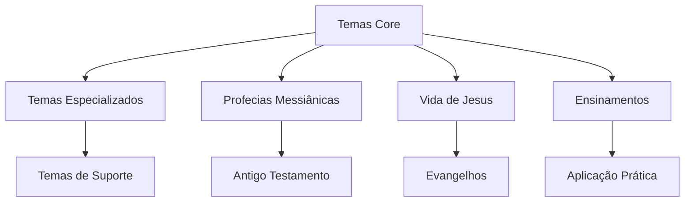
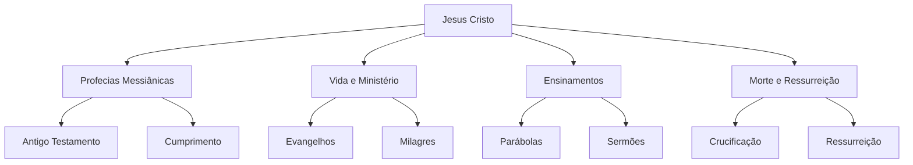

# Criar Wiki Bíblica - Metodologia para Estudos Messiânicos

> [!info] Este documento serve como metodologia para criar **páginas centrais de planejamento** de wikis bíblicas, organizando estudos messiânicos sobre Jesus por prioridades antes da implementação. Baseado na metodologia desenvolvida para estudos bíblicos e aplicável a qualquer estudo da Palavra de Deus.

## 📋 Índice
- [[#Metodologia Base]]
- [[#Análise das Escrituras]]
- [[#Estrutura da Página Central]]
- [[#Processo de Planejamento]]
- [[#Template de Página Central]]
- [[#Regras Obsidian]]
- [[#Validação e Qualidade]]
- [[#Exemplos Práticos]]
- [[#Aplicação para Diferentes Estudos]]

---

## 🎯 Metodologia Base

### 📊 **Princípio Central: "Planejamento Antes da Implementação"**

A criação de uma wiki bíblica deve começar com uma **página central de planejamento** que organiza todos os estudos messiânicos por prioridades, antes de implementar qualquer documentação específica.

### 🏗️ **Arquitetura da Metodologia**

```
Análise das Escrituras
       ↓
Identificação de Temas Messiânicos
       ↓
Organização por Prioridades
       ↓
Criação da Página Central
       ↓
Planejamento de Estudos
       ↓
Wiki Estruturada e Planejada
```

### 🎯 **Conceitos Chave**

1. **Planejamento Primeiro**: Criar estrutura antes de implementar
2. **Organização por Prioridades**: Temas core → especializados → suporte
3. **Mapeamento de Referências**: Identificar relações entre estudos
4. **Base Sólida**: Página central como ponto de partida
5. **Desenvolvimento Incremental**: 0% → 100% gradualmente

---

## 🔍 Análise das Escrituras

### 📁 **Passo 1: Estrutura dos Arquivos Bíblicos**

```bash
# Comandos de análise inicial
list_dir(relative_workspace_path="biblias")
codebase_search(query="messianic prophecies jesus")
grep_search(query="messiah|christ|jesus")
```

### 🎯 **Passo 2: Identificação de Temas Messiânicos**

```lua
-- Padrão de identificação baseado nas Escrituras
Temas_Messiânicos = {
    -- Temas Core (Alta Prioridade) - 1-5
    ["Profecias Messiânicas"] = {path = "biblias/", priority = "ALTA", impact = "FUNDAMENTAL"},
    ["Vida de Jesus"] = {path = "biblias/", priority = "ALTA", impact = "FUNDAMENTAL"},
    ["Ensinamentos de Jesus"] = {path = "biblias/", priority = "ALTA", impact = "FUNDAMENTAL"},
    ["Milagres de Jesus"] = {path = "biblias/", priority = "ALTA", impact = "FUNDAMENTAL"},
    ["Morte e Ressurreição"] = {path = "biblias/", priority = "ALTA", impact = "FUNDAMENTAL"},
    
    -- Temas Especializados (Média Prioridade) - 6-10
    ["Parábolas de Jesus"] = {path = "biblias/", priority = "MÉDIA", impact = "ENSINAMENTO"},
    ["Orações de Jesus"] = {path = "biblias/", priority = "MÉDIA", impact = "ESPIRITUAL"},
    ["Relacionamentos de Jesus"] = {path = "biblias/", priority = "MÉDIA", impact = "RELACIONAL"},
    ["Conflitos e Controvérsias"] = {path = "biblias/", priority = "MÉDIA", impact = "HISTÓRICO"},
    ["Aparições Pós-Ressurreição"] = {path = "biblias/", priority = "MÉDIA", impact = "FUNDAMENTAL"},
    
    -- Temas de Suporte (Baixa Prioridade) - 11-15
    ["Contexto Histórico"] = {path = "biblias/", priority = "BAIXA", impact = "CONTEXTUAL"},
    ["Geografia Bíblica"] = {path = "biblias/", priority = "BAIXA", impact = "CONTEXTUAL"},
    ["Cultura Judaica"] = {path = "biblias/", priority = "BAIXA", impact = "CONTEXTUAL"},
    ["Linguagem e Traduções"] = {path = "biblias/", priority = "BAIXA", impact = "TÉCNICO"},
    ["Arqueologia Bíblica"] = {path = "biblias/", priority = "BAIXA", impact = "HISTÓRICO"}
}
```

### 🔗 **Passo 3: Análise de Referências Cruzadas**



---

## 📚 Estrutura da Página Central

### 🎯 **Arquivo Principal: `estudos_messianicos_wiki.md`**

A página central deve seguir este template:

```markdown
---
tags: [biblical, messianic, jesus, study, wiki, documentation, index, guide]
type: index
aliases: [Estudos Messiânicos, Wiki de Jesus, Documentação Bíblica, Estudos sobre Cristo]
---

# Estudos Messiânicos - Wiki de Jesus

> [!info] Bem-vindo à Wiki de Estudos Messiânicos! Esta é a porta de entrada para todos os estudos sobre Jesus Cristo, organizados por prioridade e status de desenvolvimento.

## 📋 Índice
- [[#🎯 Visão Geral]]
- [[#📚 Estudos Criados]]
- [[#🚧 Estudos em Desenvolvimento]]
- [[#📋 Estudos Planejados]]
- [[#📊 Status Geral]]

---

## 🎯 Visão Geral

[Descrição dos estudos messiânicos e arquitetura geral baseada nas Escrituras]

### 🏗️ Arquitetura dos Estudos


---

## 📚 Estudos Criados

### ✅ **Estudos Completos**

> [!success] **Status**: Nenhum estudo criado ainda
> Os estudos serão desenvolvidos seguindo a metodologia baseada nas Escrituras disponíveis em `biblias/`.

---

## 🚧 Estudos em Desenvolvimento

### 🔄 **Estudos em Progresso**

> [!warning] Estes estudos estão sendo desenvolvidos ou precisam de atualizações.

> [!note] **Status**: Nenhum estudo em desenvolvimento ainda
> Os estudos serão criados conforme a análise das Escrituras avança.

---

## 📋 Estudos Planejados

### 📊 **Temas Prioritários (1-5)**

#### 1️⃣ **[[Profecias_Messiânicas_Guide]]** ❌
- **Descrição**: Estudo das profecias messiânicas no Antigo Testamento e seu cumprimento em Jesus
- **Conteúdo**: Análise de passagens proféticas, cumprimento nos Evangelhos
- **Dependências**: Antigo Testamento, Evangelhos
- **Impacto**: Alto - Fundamento da fé messiânica
- **Arquivos Base**: `biblias/KJV.json`, `biblias/TR.json`, `biblias/Vulgate.json`

#### 2️⃣ **[[Vida_de_Jesus_Guide]]** ❌
- **Descrição**: Cronologia e eventos principais da vida de Jesus Cristo
- **Conteúdo**: Nascimento, ministério, milagres, ensinamentos
- **Dependências**: Evangelhos, contexto histórico
- **Impacto**: Alto - Base para compreensão do ministério
- **Arquivos Base**: `biblias/KJV.json`, `biblias/TR.json`

#### 3️⃣ **[[Ensinamentos_de_Jesus_Guide]]** ❌
- **Descrição**: Análise sistemática dos ensinamentos de Jesus Cristo
- **Conteúdo**: Sermões, parábolas, conversas, princípios
- **Dependências**: Evangelhos, contexto cultural
- **Impacto**: Alto - Aplicação prática dos ensinamentos
- **Arquivos Base**: `biblias/KJV.json`, `biblias/TR.json`

#### 4️⃣ **[[Milagres_de_Jesus_Guide]]** ❌
- **Descrição**: Estudo dos milagres realizados por Jesus Cristo
- **Conteúdo**: Categorização, significado, contexto, aplicação
- **Dependências**: Evangelhos, contexto histórico
- **Impacto**: Alto - Demonstração do poder divino
- **Arquivos Base**: `biblias/KJV.json`, `biblias/TR.json`

#### 5️⃣ **[[Morte_Ressurreicao_Guide]]** ❌
- **Descrição**: Análise da morte e ressurreição de Jesus Cristo
- **Conteúdo**: Crucificação, sepultamento, ressurreição, aparições
- **Dependências**: Evangelhos, cartas paulinas
- **Impacto**: Alto - Evento central da fé cristã
- **Arquivos Base**: `biblias/KJV.json`, `biblias/TR.json`

### 🎯 **Temas Especializados (6-10)**

#### 6️⃣ **[[Parábolas_de_Jesus_Guide]]** ❌
- **Descrição**: Estudo sistemático das parábolas de Jesus
- **Conteúdo**: Interpretação, contexto, aplicação prática
- **Dependências**: Evangelhos, contexto cultural
- **Impacto**: Médio - Ensino através de histórias
- **Arquivos Base**: `biblias/KJV.json`, `biblias/TR.json`

#### 7️⃣ **[[Orações_de_Jesus_Guide]]** ❌
- **Descrição**: Análise das orações registradas de Jesus
- **Conteúdo**: Pai Nosso, oração sacerdotal, orações no Getsêmani
- **Dependências**: Evangelhos, contexto espiritual
- **Impacto**: Médio - Modelo de oração
- **Arquivos Base**: `biblias/KJV.json`, `biblias/TR.json`

#### 8️⃣ **[[Relacionamentos_Jesus_Guide]]** ❌
- **Descrição**: Estudo dos relacionamentos de Jesus com diferentes grupos
- **Conteúdo**: Discípulos, fariseus, pecadores, autoridades
- **Dependências**: Evangelhos, contexto histórico
- **Impacto**: Médio - Modelo de relacionamentos
- **Arquivos Base**: `biblias/KJV.json`, `biblias/TR.json`

#### 9️⃣ **[[Conflitos_Controversias_Guide]]** ❌
- **Descrição**: Análise dos conflitos e controvérsias de Jesus
- **Conteúdo**: Debates com fariseus, conflitos religiosos, julgamento
- **Dependências**: Evangelhos, contexto histórico
- **Impacto**: Médio - Contexto histórico e teológico
- **Arquivos Base**: `biblias/KJV.json`, `biblias/TR.json`

#### 🔟 **[[Aparições_Pos_Ressurreicao_Guide]]** ❌
- **Descrição**: Estudo das aparições de Jesus após a ressurreição
- **Conteúdo**: Aparições aos discípulos, comissão, ascensão
- **Dependências**: Evangelhos, Atos dos Apóstolos
- **Impacto**: Médio - Confirmação da ressurreição
- **Arquivos Base**: `biblias/KJV.json`, `biblias/TR.json`

### 📚 **Temas Secundários (11-15)**

#### 1️⃣1️⃣ **[[Contexto_Historico_Guide]]** ❌
- **Descrição**: Contexto histórico do tempo de Jesus
- **Conteúdo**: Império Romano, Palestina, grupos religiosos
- **Dependências**: Histórias seculares, arqueologia
- **Impacto**: Baixo - Contexto para compreensão
- **Arquivos Base**: `biblias/KJV.json`, `biblias/TR.json`

#### 1️⃣2️⃣ **[[Geografia_Biblica_Guide]]** ❌
- **Descrição**: Geografia dos lugares mencionados nos Evangelhos
- **Conteúdo**: Lugares, rotas, distâncias, relevância
- **Dependências**: Evangelhos, mapas históricos
- **Impacto**: Baixo - Contexto geográfico
- **Arquivos Base**: `biblias/KJV.json`, `biblias/TR.json`

#### 1️⃣3️⃣ **[[Cultura_Judaica_Guide]]** ❌
- **Descrição**: Estudo da cultura judaica do primeiro século
- **Conteúdo**: Festividades, costumes, leis, tradições
- **Dependências**: Antigo Testamento, fontes históricas
- **Impacto**: Baixo - Contexto cultural
- **Arquivos Base**: `biblias/KJV.json`, `biblias/TR.json`

#### 1️⃣4️⃣ **[[Linguagem_Traducoes_Guide]]** ❌
- **Descrição**: Análise das línguas e traduções bíblicas
- **Conteúdo**: Hebraico, aramaico, grego, traduções
- **Dependências**: Textos originais, estudos linguísticos
- **Impacto**: Baixo - Precisão textual
- **Arquivos Base**: `biblias/WLC.json`, `biblias/TR.json`, `biblias/Vulgate.json`

#### 1️⃣5️⃣ **[[Arqueologia_Biblica_Guide]]** ❌
- **Descrição**: Descobertas arqueológicas relacionadas a Jesus
- **Conteúdo**: Sítios arqueológicos, artefatos, confirmações
- **Dependências**: Arqueologia, história secular
- **Impacto**: Baixo - Evidência histórica
- **Arquivos Base**: `biblias/KJV.json`, `biblias/TR.json`

### 🛠️ **Guias de Desenvolvimento (16-20)**

#### 1️⃣6️⃣ **[[Metodologia_Estudo_Biblico_Guide]]** ❌
- **Descrição**: Guia metodológico para estudos bíblicos
- **Conteúdo**: Técnicas de estudo, ferramentas, recursos
- **Dependências**: Metodologia, recursos
- **Impacto**: Médio - Ferramentas de estudo
- **Arquivos Base**: Metodologia geral

#### 1️⃣7️⃣ **[[Recursos_Estudo_Guide]]** ❌
- **Descrição**: Compilação de recursos para estudo bíblico
- **Conteúdo**: Comentários, dicionários, concordâncias
- **Dependências**: Recursos externos
- **Impacto**: Médio - Recursos de estudo
- **Arquivos Base**: Recursos diversos

#### 1️⃣8️⃣ **[[Aplicacao_Pratica_Guide]]** ❌
- **Descrição**: Guia de aplicação prática dos ensinamentos
- **Conteúdo**: Princípios, exemplos, exercícios práticos
- **Dependências**: Ensinamentos de Jesus
- **Impacto**: Alto - Aplicação na vida
- **Arquivos Base**: `biblias/KJV.json`, `biblias/TR.json`

#### 1️⃣9️⃣ **[[Devocional_Guide]]** ❌
- **Descrição**: Guia devocional baseado na vida de Jesus
- **Conteúdo**: Reflexões diárias, orações, meditações
- **Dependências**: Evangelhos, vida espiritual
- **Impacto**: Alto - Crescimento espiritual
- **Arquivos Base**: `biblias/KJV.json`, `biblias/TR.json`

#### 2️⃣0️⃣ **[[Evangelismo_Guide]]** ❌
- **Descrição**: Guia de evangelismo baseado no exemplo de Jesus
- **Conteúdo**: Métodos, princípios, exemplos bíblicos
- **Dependências**: Evangelhos, Atos dos Apóstolos
- **Impacto**: Alto - Compartilhamento da fé
- **Arquivos Base**: `biblias/KJV.json`, `biblias/TR.json`

### 📖 **Referências Bíblicas (21-25)**

#### 2️⃣1️⃣ **[[Concordancia_Messianica_Guide]]** ❌
- **Descrição**: Concordância temática de passagens messiânicas
- **Conteúdo**: Índice temático, referências cruzadas
- **Dependências**: Toda a Bíblia
- **Impacto**: Médio - Ferramenta de referência
- **Arquivos Base**: Todos os arquivos em `biblias/`

#### 2️⃣2️⃣ **[[Cronologia_Biblica_Guide]]** ❌
- **Descrição**: Cronologia dos eventos da vida de Jesus
- **Conteúdo**: Linha do tempo, datas, sequência
- **Dependências**: Evangelhos, história secular
- **Impacto**: Baixo - Contexto temporal
- **Arquivos Base**: `biblias/KJV.json`, `biblias/TR.json`

#### 2️⃣3️⃣ **[[Mapas_Biblicos_Guide]]** ❌
- **Descrição**: Mapas e localizações bíblicas
- **Conteúdo**: Mapas interativos, rotas, lugares
- **Dependências**: Geografia, história
- **Impacto**: Baixo - Contexto geográfico
- **Arquivos Base**: `biblias/KJV.json`, `biblias/TR.json`

#### 2️⃣4️⃣ **[[Personagens_Biblicos_Guide]]** ❌
- **Descrição**: Estudo dos personagens relacionados a Jesus
- **Conteúdo**: Discípulos, fariseus, autoridades, outros
- **Dependências**: Evangelhos, história
- **Impacto**: Médio - Contexto relacional
- **Arquivos Base**: `biblias/KJV.json`, `biblias/TR.json`

#### 2️⃣5️⃣ **[[Temas_Biblicos_Guide]]** ❌
- **Descrição**: Análise de temas bíblicos relacionados a Jesus
- **Conteúdo**: Reino de Deus, salvação, graça, amor
- **Dependências**: Toda a Bíblia
- **Impacto**: Alto - Compreensão teológica
- **Arquivos Base**: Todos os arquivos em `biblias/`

---

## 📊 Status Geral

### 📈 **Estatísticas da Wiki**

| Categoria | Total | Documentado | Em Desenvolvimento | Não Documentado |
|-----------|-------|-------------|-------------------|-----------------|
| **Prioridade 1-5** | 5 | 0 | 0 | 5 |
| **Prioridade 6-10** | 5 | 0 | 0 | 5 |
| **Prioridade 11-15** | 5 | 0 | 0 | 5 |
| **Desenvolvimento** | 5 | 0 | 0 | 5 |
| **Referência** | 5 | 0 | 0 | 5 |
| **Total Geral** | 25 | **0** ❌ | 0 | **25** ❌ |

### 🎯 **Progresso por Área**

#### ❌ **Não Documentado**
- **Temas Core**: Profecias Messiânicas, Vida de Jesus, Ensinamentos, Milagres, Morte e Ressurreição
- **Temas Especializados**: Parábolas, Orações, Relacionamentos, Conflitos, Aparições
- **Temas Secundários**: Contexto Histórico, Geografia, Cultura Judaica, Linguagem, Arqueologia
- **Desenvolvimento**: Metodologia, Recursos, Aplicação, Devocional, Evangelismo
- **Referência**: Concordância, Cronologia, Mapas, Personagens, Temas

### 🚀 **Próximos Passos Recomendados**

> [!tip] **Prioridade 1**: Fundamento da fé messiânica
> - [[Profecias_Messiânicas_Guide]] - Estudo das profecias e seu cumprimento
> - [[Vida_de_Jesus_Guide]] - Cronologia e eventos da vida de Cristo
> - [[Ensinamentos_de_Jesus_Guide]] - Análise sistemática dos ensinamentos

> [!tip] **Prioridade 2**: Manifestação do poder divino
> - [[Milagres_de_Jesus_Guide]] - Estudo dos milagres de Jesus
> - [[Morte_Ressurreicao_Guide]] - Evento central da fé cristã

> [!tip] **Prioridade 3**: Aplicação prática dos ensinamentos
> - [[Parábolas_de_Jesus_Guide]] - Ensino através de histórias
> - [[Aplicacao_Pratica_Guide]] - Como aplicar os ensinamentos
> - [[Devocional_Guide]] - Crescimento espiritual

---

> [!success] **Status Atual**: 0/25 estudos completos (0% da wiki)

> [!note] **Base Planejada**: A estrutura está completamente planejada e organizada por prioridades, seguindo a metodologia baseada nas Escrituras disponíveis em `biblias/`.

> [!warning] **Próximas Prioridades**: Focar nos temas core (1-5) para estabelecer o fundamento dos estudos messiânicos sobre Jesus Cristo.

---

## 🔄 Processo de Planejamento

### 📋 **Checklist Completo**

#### **Fase 1: Análise (Dias 1-2)**
- [ ] Analisar arquivos bíblicos em `biblias/`
- [ ] Identificar temas messiânicos principais
- [ ] Mapear referências cruzadas
- [ ] Definir prioridades
- [ ] Criar plano de estudos

#### **Fase 2: Planejamento (Dias 3-4)**
- [ ] Criar estrutura de pastas
- [ ] Definir template de página central
- [ ] Estabelecer padrões de formatação
- [ ] Configurar sistema de tags
- [ ] **Criar página principal de planejamento**

#### **Fase 3: Organização (Dias 5-6)**
- [ ] Organizar temas por prioridades
- [ ] Mapear dependências entre estudos
- [ ] Definir impacto de cada tema
- [ ] Criar estatísticas de progresso
- [ ] Estabelecer próximos passos

#### **Fase 4: Validação (Dias 7)**
- [ ] Verificar estrutura de pastas
- [ ] Validar organização por prioridades
- [ ] Revisar mapeamento de dependências
- [ ] Confirmar arquivos bíblicos referenciados
- [ ] Finalizar página central

### 🎯 **Comandos de Análise**

```bash
# Análise inicial
list_dir(relative_workspace_path="biblias")
codebase_search(query="messianic prophecies jesus")

# Busca por temas específicos
grep_search(query="messiah|christ|jesus")
codebase_search(query="prophecy fulfillment")

# Análise de arquivos específicos
read_file(target_file="biblias/KJV.json", should_read_entire_file=false, start_line_one_indexed=1, end_line_one_indexed_inclusive=100)
```

---

## 📝 Template de Página Central

### 🎯 **Template Base para Página Central**

```markdown
---
tags: [biblical, messianic, jesus, study, wiki, documentation, index, guide]
type: index
aliases: [Estudos Messiânicos, Wiki de Jesus, Documentação Bíblica, Estudos sobre Cristo]
---

# Estudos Messiânicos - Wiki de Jesus

> [!info] Bem-vindo à Wiki de Estudos Messiânicos! Esta é a porta de entrada para todos os estudos sobre Jesus Cristo, organizados por prioridade e status de desenvolvimento.

## 📋 Índice
- [[#🎯 Visão Geral]]
- [[#📚 Estudos Criados]]
- [[#🚧 Estudos em Desenvolvimento]]
- [[#📋 Estudos Planejados]]
- [[#📊 Status Geral]]

---

## 🎯 Visão Geral

[Descrição dos estudos messiânicos baseada nas Escrituras disponíveis em `biblias/`]

### 🏗️ Arquitetura dos Estudos


---

## 📚 Estudos Criados

### ✅ **Estudos Completos**

> [!success] **Status**: Nenhum estudo criado ainda
> Os estudos serão desenvolvidos seguindo a metodologia baseada nas Escrituras disponíveis em `biblias/`.

---

## 🚧 Estudos em Desenvolvimento

### 🔄 **Estudos em Progresso**

> [!warning] Estes estudos estão sendo desenvolvidos ou precisam de atualizações.

> [!note] **Status**: Nenhum estudo em desenvolvimento ainda
> Os estudos serão criados conforme a análise das Escrituras avança.

---

## 📋 Estudos Planejados

### 📊 **Temas Prioritários (1-5)**

#### 1️⃣ **[[Profecias_Messiânicas_Guide]]** ❌
- **Descrição**: Estudo das profecias messiânicas no Antigo Testamento e seu cumprimento em Jesus
- **Conteúdo**: Análise de passagens proféticas, cumprimento nos Evangelhos
- **Dependências**: Antigo Testamento, Evangelhos
- **Impacto**: Alto - Fundamento da fé messiânica
- **Arquivos Base**: `biblias/KJV.json`, `biblias/TR.json`, `biblias/Vulgate.json`

[Repetir para temas 2-5]

### 🎯 **Temas Especializados (6-10)**

[Repetir estrutura para temas 6-10]

### 📚 **Temas Secundários (11-15)**

[Repetir estrutura para temas 11-15]

### 🛠️ **Guias de Desenvolvimento (16-20)**

[Repetir estrutura para guias 16-20]

### 📖 **Referências Bíblicas (21-25)**

[Repetir estrutura para referências 21-25]

---

## 📊 Status Geral

### 📈 **Estatísticas da Wiki**

| Categoria | Total | Documentado | Em Desenvolvimento | Não Documentado |
|-----------|-------|-------------|-------------------|-----------------|
| **Prioridade 1-5** | 5 | 0 | 0 | 5 |
| **Prioridade 6-10** | 5 | 0 | 0 | 5 |
| **Prioridade 11-15** | 5 | 0 | 0 | 5 |
| **Desenvolvimento** | 5 | 0 | 0 | 5 |
| **Referência** | 5 | 0 | 0 | 5 |
| **Total Geral** | 25 | **0** ❌ | 0 | **25** ❌ |

### 🎯 **Progresso por Área**

#### ❌ **Não Documentado**
- **Temas Core**: [Lista de temas core]
- **Temas Especializados**: [Lista de temas especializados]
- **Temas Secundários**: [Lista de temas secundários]
- **Desenvolvimento**: [Lista de guias de desenvolvimento]
- **Referência**: [Lista de documentação de referência]

### 🚀 **Próximos Passos Recomendados**

> [!tip] **Prioridade 1**: Fundamento da fé messiânica
> - [[Profecias_Messiânicas_Guide]] - [Descrição]
> - [[Vida_de_Jesus_Guide]] - [Descrição]
> - [[Ensinamentos_de_Jesus_Guide]] - [Descrição]

> [!tip] **Prioridade 2**: Manifestação do poder divino
> - [[Milagres_de_Jesus_Guide]] - [Descrição]
> - [[Morte_Ressurreicao_Guide]] - [Descrição]

> [!tip] **Prioridade 3**: Aplicação prática dos ensinamentos
> - [[Parábolas_de_Jesus_Guide]] - [Descrição]
> - [[Aplicacao_Pratica_Guide]] - [Descrição]
> - [[Devocional_Guide]] - [Descrição]

---

> [!success] **Status Atual**: 0/25 estudos completos (0% da wiki)

> [!note] **Base Planejada**: A estrutura está completamente planejada e organizada por prioridades, seguindo a metodologia baseada nas Escrituras disponíveis em `biblias/`.

> [!warning] **Próximas Prioridades**: [Descrição das próximas prioridades]
```

### 📁 **Estrutura de Pastas Recomendada**

```
wiki/
├── estudos_messianicos_wiki.md    # Página principal (PLANEJAMENTO)
├── estudos/                       # Documentação de estudos (FUTURO)
│   ├── core/                     # Temas core
│   ├── specialized/              # Temas especializados
│   └── support/                 # Temas de suporte
├── guias/                        # Guias práticos (FUTURO)
│   ├── metodologia_estudo.md
│   ├── aplicacao_pratica.md
│   └── devocional.md
└── referencias/                  # Referências bíblicas (FUTURO)
    ├── concordancia_messianica.md
    ├── cronologia_biblica.md
    └── mapas_biblicos.md
```

---

## 📖 Regras Obsidian

### 🎯 **Formatação Padrão**

#### **Frontmatter Obrigatório**
```yaml
---
tags: [biblical, messianic, jesus, study, wiki, documentation, index, guide]
type: index
aliases: [Estudos Messiânicos, Wiki de Jesus, Documentação Bíblica, Estudos sobre Cristo]
---
```

#### **Callouts Padrão**
```markdown
> [!info] Informação geral
> [!note] Nota importante
> [!warning] Aviso
> [!error] Erro crítico
> [!tip] Dica útil
> [!success] Sucesso
> [!bible] Citação bíblica
> [!study] Estudo bíblico
> [!context] Contexto histórico
```

#### **Links Internos**
```markdown
-- Usar wikilinks
[[Nome do Documento]]
[[Nome do Documento#Seção]]

-- Evitar links markdown
[Nome](link)  # Não usar
```

#### **Separadores**
```markdown
---

## Seção Principal

---

### Subseção

---
```

### 🏷️ **Sistema de Tags**

#### **Tags Padrão por Categoria**
```yaml
# Bíblico
- biblical
- messianic
- jesus
- study

# Categoria
- core-themes
- specialized-themes
- support-themes
- guides
- references

# Tipo
- guide
- documentation
- study
- tutorial
- reference

# Status
- completed
- in-progress
- planned
```

### 📊 **Estrutura Hierárquica**

#### **Níveis de Título**
```markdown
# Título Principal (H1)
## Seção Principal (H2)
### Subseção (H3)
#### Subsubseção (H4)
##### Detalhe (H5)
###### Específico (H6)
```

---

## ✅ Validação e Qualidade

### 🎯 **Critérios de Validação**

#### **1. Estrutura de Planejamento (100%)**
- [ ] Página central criada
- [ ] Temas organizados por prioridades
- [ ] Referências cruzadas mapeadas
- [ ] Arquivos bíblicos referenciados
- [ ] Estatísticas de progresso definidas

#### **2. Organização (95%+)**
- [ ] Estudos organizados logicamente
- [ ] Prioridades bem definidas
- [ ] Impacto de cada tema claro
- [ ] Próximos passos estabelecidos

#### **3. Consistência (98%+)**
- [ ] Formatação padronizada
- [ ] Estrutura hierárquica lógica
- [ ] Tags e metadados consistentes
- [ ] Nomenclatura padronizada

#### **4. Base Sólida (90%+)**
- [ ] Análise das Escrituras completa
- [ ] Temas identificados corretamente
- [ ] Referências cruzadas mapeadas adequadamente
- [ ] Estrutura preparada para desenvolvimento

### 📊 **Métricas de Qualidade**

```lua
-- Script de validação
function validateBiblicalWikiPlanning()
    local metrics = {
        structure = 100,    -- % de estrutura planejada
        organization = 95,  -- % de organização por prioridades
        consistency = 98,   -- % de formatação consistente
        analysis = 90,      -- % de análise das Escrituras
        planning = 100      -- % de planejamento completo
    }
    return metrics
end
```

### 🔍 **Processo de Validação**

#### **Validação Automática**
```bash
# Verificar estrutura de pastas
list_dir(relative_workspace_path="wiki")

# Verificar arquivo principal
read_file(target_file="wiki/estudos_messianicos_wiki.md", should_read_entire_file=false, start_line_one_indexed=1, end_line_one_indexed_inclusive=50)

# Verificar organização
grep_search(query="Temas Prioritários")
grep_search(query="Temas Especializados")
```

#### **Validação Manual**
- [ ] Revisar organização por prioridades
- [ ] Verificar mapeamento de referências cruzadas
- [ ] Confirmar arquivos bíblicos referenciados
- [ ] Validar estrutura hierárquica
- [ ] Revisar consistência de formatação

---

## 🎯 Aplicação para Diferentes Estudos

### 📖 **Para Estudos do Antigo Testamento**
```markdown
Foco:
- Profecias messiânicas
- Tipos e sombras
- Preparação para o Messias
- Contexto histórico

Estrutura:
- Profecias System
- Tipos System
- História System
- Contexto System
```

### 📖 **Para Estudos dos Evangelhos**
```markdown
Foco:
- Vida e ministério de Jesus
- Ensinamentos e parábolas
- Milagres e sinais
- Relacionamentos

Estrutura:
- Vida de Jesus System
- Ensinamentos System
- Milagres System
- Relacionamentos System
```

### 📖 **Para Estudos das Cartas**
```markdown
Foco:
- Teologia paulina
- Aplicação dos ensinamentos
- Desenvolvimento da igreja
- Doutrinas fundamentais

Estrutura:
- Teologia System
- Aplicação System
- Igreja System
- Doutrinas System
```

---

## 🔧 Comandos Úteis

### 📁 **Análise de Estrutura**
```bash
# Listar estrutura do projeto
list_dir(relative_workspace_path=".")

# Buscar temas messiânicos
codebase_search(query="messianic prophecies jesus")

# Analisar arquivos bíblicos específicos
read_file(target_file="biblias/KJV.json", should_read_entire_file=false, start_line_one_indexed=1, end_line_one_indexed_inclusive=100)
```

### 🔍 **Validação de Estrutura**
```bash
# Verificar se página central existe
file_search(query="estudos_messianicos_wiki.md")

# Buscar organização por prioridades
grep_search(query="Temas Prioritários")

# Verificar mapeamento de temas
grep_search(query="Temas Especializados")
```

### 📊 **Análise de Referências**
```bash
# Buscar referências cruzadas
grep_search(query="prophecy|fulfillment")

# Analisar dependências entre temas
codebase_search(query="messianic reference cross")
```

---

## 📋 Checklist Final

### ✅ **Antes de Começar**
- [ ] Entender o foco (estudos messiânicos sobre Jesus)
- [ ] Analisar arquivos bíblicos em `biblias/`
- [ ] Identificar temas messiânicos principais
- [ ] Definir prioridades
- [ ] Criar plano de estudos

### ✅ **Durante o Planejamento**
- [ ] Seguir template estabelecido
- [ ] Organizar por prioridades
- [ ] Mapear referências cruzadas
- [ ] Referenciar arquivos bíblicos
- [ ] Criar estatísticas de progresso

### ✅ **Após o Planejamento**
- [ ] Validar estrutura organizacional
- [ ] Verificar mapeamento de referências
- [ ] Confirmar arquivos bíblicos referenciados
- [ ] Revisar consistência
- [ ] Estabelecer próximos passos

---

## 🎯 Conclusão

Esta metodologia garante **planejamento sólido** antes da implementação, criando uma base estruturada para wikis bíblicas aplicável a qualquer tipo de estudo da Palavra de Deus.

### 🏆 **Princípios Fundamentais**

1. **Planejamento Primeiro**: Criar estrutura antes de implementar
2. **Organização por Prioridades**: Temas core → especializados → suporte
3. **Mapeamento de Referências**: Identificar relações entre estudos
4. **Base Sólida**: Página central como ponto de partida
5. **Desenvolvimento Incremental**: 0% → 100% gradualmente

### 🚀 **Resultado Esperado**

- ✅ **100% de estrutura planejada**
- ✅ **Organização por prioridades**
- ✅ **Mapeamento de referências cruzadas**
- ✅ **Estrutura hierárquica lógica**
- ✅ **Base sólida para desenvolvimento**
- ✅ **Consistência total**

Esta metodologia pode ser aplicada para criar páginas centrais de planejamento para qualquer estudo bíblico, seja messiânico, doutrinário, histórico ou devocional! 🎉 