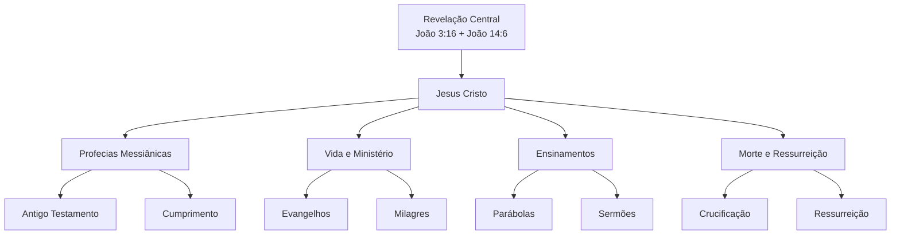

# Estudos Messiânicos - Wiki de Jesus

> [!info] Bem-vindo à Wiki de Estudos Messiânicos! Esta é a porta de entrada para todos os estudos sobre Jesus Cristo, organizados por prioridade e status de desenvolvimento. Baseado nas Escrituras disponíveis em `biblias/` e focado em encontrar a Verdade na Palavra de Deus.

## 📋 Índice
- [[#🎯 A Revelação Central da Bíblia]]
- [[#📖 Fundamento Bíblico]]
- [[#🎯 Visão Geral]]
- [[#📚 Estudos Criados]]
- [[#🚧 Estudos em Desenvolvimento]]
- [[#📋 Estudos Planejados]]
- [[#📊 Status Geral]]

---

## 🎯 A Revelação Central da Bíblia

### 📖 **João 3:16 (KJV) - O Evangelho Central**
> [!bible] **"For God so loved the world, that he gave his only begotten Son, that whosoever believeth in him should not perish, but have everlasting life."**

### 🎯 **João 14:6 (KJV) - A Declaração Central de Jesus**
> [!bible] **"Jesus saith unto him, I am the way, the truth, and the life: no man cometh unto the Father, but by me."**

### 🔍 **O PONTO CENTRAL REVELADO**

#### **1. O AMOR DE DEUS**
- ✅ **Deus AMOU** o mundo (humanidade caída)
- ✅ **Deus DEU** seu Filho único
- ✅ **Deus OFERECE** vida eterna

#### **2. A PESSOA DE CRISTO**
- ✅ **Jesus é o CAMINHO** - único acesso ao Pai
- ✅ **Jesus é a VERDADE** - revelação completa de Deus
- ✅ **Jesus é a VIDA** - fonte de vida eterna

#### **3. A SALVAÇÃO PELA FÉ**
- ✅ **"whosoever believeth"** - salvação pela fé
- ✅ **"should not perish"** - livramento da condenação
- ✅ **"everlasting life"** - vida eterna como dom

### 🎯 **A REVELAÇÃO CENTRAL EM UMA FRASE**

**"Deus amou tanto a humanidade que enviou Jesus Cristo como único Salvador, oferecendo vida eterna a todos que creem nEle."**

---

## 📖 Fundamento Bíblico

### 🎯 **Por que partir desta Revelação Central:**

- ✅ **Unifica toda a Bíblia** - do Gênesis ao Apocalipse
- ✅ **Resolve o problema do pecado** - separação de Deus
- ✅ **Oferece solução definitiva** - não há outro caminho
- ✅ **Manifesta o caráter de Deus** - amor e justiça
- ✅ **Define o propósito da vida** - relacionamento com Deus

### 📋 **Elementos Essenciais:**

1. **AMOR DIVINO** - Deus tomou a iniciativa
2. **SACRIFÍCIO ÚNICO** - Jesus como único caminho
3. **SALVAÇÃO UNIVERSAL** - disponível para todos
4. **FÉ COMO RESPOSTA** - crença como condição
5. **VIDA ETERNA** - resultado da salvação

> [!bible] **FUNDAMENTO**: Esta é a "boa notícia" (evangelho) que permeia toda a Escritura - Deus reconcilia a humanidade consigo mesmo através de Jesus Cristo.

> [!study] **CONCLUSÃO**: A grande revelação da Bíblia é que **Deus ama a humanidade e oferece salvação através de Jesus Cristo**, estabelecendo um relacionamento eterno baseado na fé.

---

## 🎯 Visão Geral

Esta wiki foi criada para organizar e desenvolver estudos messiânicos sobre Jesus Cristo, **partindo sempre da revelação central** das Escrituras Sagradas disponíveis em `biblias/`. O objetivo é criar uma documentação estruturada e completa que permita encontrar a Verdade na Palavra de Deus através de estudos sistemáticos sobre o Messias.

### 🏗️ Arquitetura dos Estudos

### 📖 **Fonte Autoritativa**
- **Arquivos Bíblicos**: Todos os estudos são baseados nos arquivos JSON em `biblias/`
- **Versões Disponíveis**: KJV, TR, Vulgate, VulgClementine, WLC
- **Metodologia**: Análise sistemática e contextual das Escrituras
- **Objetivo**: Encontrar a Verdade na Palavra de Deus
- **Base Fundamental**: Revelação central de João 3:16 e João 14:6

---

## 📚 Estudos Criados

### ✅ **Estudos Completos**

#### ✅ **[[Revelacao_Central_Guide]]** ✅
- **Status**: **COMPLETO** - Guia primordial da revelação central
- **Descrição**: Estudo aprofundado da revelação central da Bíblia (João 3:16 e João 14:6)
- **Conteúdo**: Storytelling, análise profunda das palavras, cruzamento de informações bíblicas
- **Impacto**: **MÁXIMO** - Fundamento de toda a fé cristã
- **Arquivos Base**: `biblias/KJV.json`, `biblias/TR.json`, `biblias/Vulgate.json`
- **Referências Bíblicas**: João 3:16, João 14:6, 1 João 4:9-10, Romanos 5:8

#### ✅ **[[Ensinamentos_de_Jesus_Guide]]** ✅
- **Status**: **COMPLETO** - Guia completo dos ensinamentos de Jesus
- **Descrição**: Análise sistemática dos ensinamentos de Jesus Cristo
- **Conteúdo**: Bem-aventuranças, Pai Nosso, parábolas, declarações "Em verdade vos digo", ensinamentos sobre Reino, amor, oração, riquezas, perdão
- **Impacto**: **ALTO** - Aplicação prática dos ensinamentos
- **Arquivos Base**: `biblias/KJV.json`, `biblias/TR.json`, `biblias/Vulgate.json`
- **Referências Bíblicas**: Sermão da Montanha (Mateus 5-7), João 14-17, Lucas 6:20-49, Mateus 13 (parábolas), Mateus 6:9-13 (Pai Nosso)

#### ✅ **[[Morte_Ressurreicao_Guide]]** ✅
- **Status**: **COMPLETO** - Guia completo da morte e ressurreição de Jesus
- **Descrição**: Análise da morte e ressurreição de Jesus Cristo
- **Conteúdo**: Cronologia dos eventos, crucificação, ressurreição, aparições pós-ressurreição, sete palavras da cruz, significado teológico, aplicação pessoal
- **Impacto**: **ALTO** - Evento central da fé cristã
- **Arquivos Base**: `biblias/KJV.json`, `biblias/TR.json`, `biblias/Vulgate.json`
- **Referências Bíblicas**: Mateus 27-28, Marcos 15-16, Lucas 23-24, João 19-21, 1 Coríntios 15, Isaías 53

> [!success] **Status**: Primeiro estudo fundamental criado
> O guia primordial da revelação central foi criado com storytelling e cruzamento de informações das Escrituras para encontrar a verdade escondida e óbvia.

---

## 🚧 Estudos em Desenvolvimento

### 🔄 **Estudos em Progresso**

> [!warning] Estes estudos estão sendo desenvolvidos ou precisam de atualizações.

> [!note] **Status**: Nenhum estudo em desenvolvimento ainda
> Os próximos estudos serão criados conforme a análise das Escrituras avança, sempre fundamentados na revelação central.

---

## 📋 Estudos Planejados

### 📊 **Temas Prioritários (1-5)**

#### 1️⃣ **[[Revelacao_Central_Guide]]** ✅
- **Status**: **COMPLETO** - Guia primordial criado
- **Descrição**: Estudo aprofundado da revelação central da Bíblia (João 3:16 e João 14:6)
- **Conteúdo**: Análise detalhada do amor de Deus, pessoa de Cristo, salvação pela fé
- **Dependências**: Evangelho de João, contexto bíblico geral
- **Impacto**: **MÁXIMO** - Fundamento de toda a fé cristã
- **Arquivos Base**: `biblias/KJV.json`, `biblias/TR.json`, `biblias/Vulgate.json`
- **Referências Bíblicas**: João 3:16, João 14:6, 1 João 4:9-10, Romanos 5:8

#### 2️⃣ **[[Profecias_Messiânicas_Guide]]** ❌
- **Descrição**: Estudo das profecias messiânicas no Antigo Testamento e seu cumprimento em Jesus
- **Conteúdo**: Análise de passagens proféticas, cumprimento nos Evangelhos, tipologia bíblica
- **Dependências**: Antigo Testamento, Evangelhos
- **Impacto**: Alto - Fundamento da fé messiânica
- **Arquivos Base**: `biblias/KJV.json`, `biblias/TR.json`, `biblias/Vulgate.json`
- **Referências Bíblicas**: Isaías 7:14, 9:6, 53:1-12; Miquéias 5:2; Salmos 22:1-31

#### 3️⃣ **[[Vida_de_Jesus_Guide]]** ❌
- **Descrição**: Cronologia e eventos principais da vida de Jesus Cristo
- **Conteúdo**: Nascimento, ministério, milagres, ensinamentos, cronologia detalhada
- **Dependências**: Evangelhos, contexto histórico
- **Impacto**: Alto - Base para compreensão do ministério
- **Arquivos Base**: `biblias/KJV.json`, `biblias/TR.json`
- **Referências Bíblicas**: Lucas 1-2, Mateus 1-2, Marcos 1:1-13, João 1:1-18

#### 4️⃣ **[[Ensinamentos_de_Jesus_Guide]]** ✅
- **Status**: **COMPLETO** - Guia completo dos ensinamentos de Jesus
- **Descrição**: Análise sistemática dos ensinamentos de Jesus Cristo
- **Conteúdo**: Bem-aventuranças, Pai Nosso, parábolas, declarações "Em verdade vos digo", ensinamentos sobre Reino, amor, oração, riquezas, perdão
- **Dependências**: Evangelhos, contexto cultural
- **Impacto**: Alto - Aplicação prática dos ensinamentos
- **Arquivos Base**: `biblias/KJV.json`, `biblias/TR.json`, `biblias/Vulgate.json`
- **Referências Bíblicas**: Sermão da Montanha (Mateus 5-7), João 14-17, Lucas 6:20-49, Mateus 13 (parábolas), Mateus 6:9-13 (Pai Nosso)

#### 5️⃣ **[[Milagres_de_Jesus_Guide]]** ❌
- **Descrição**: Estudo dos milagres realizados por Jesus Cristo
- **Conteúdo**: Categorização, significado, contexto, aplicação, poder divino
- **Dependências**: Evangelhos, contexto histórico
- **Impacto**: Alto - Demonstração do poder divino
- **Arquivos Base**: `biblias/KJV.json`, `biblias/TR.json`
- **Referências Bíblicas**: João 2:1-11, Marcos 4:35-41, Lucas 7:11-17, João 11:1-44

### 🎯 **Temas Especializados (6-10)**

#### 6️⃣ **[[Morte_Ressurreicao_Guide]]** ✅
- **Status**: **COMPLETO** - Guia completo da morte e ressurreição de Jesus
- **Descrição**: Análise da morte e ressurreição de Jesus Cristo
- **Conteúdo**: Cronologia dos eventos, crucificação, ressurreição, aparições pós-ressurreição, sete palavras da cruz, significado teológico, aplicação pessoal
- **Dependências**: Evangelhos, cartas paulinas
- **Impacto**: Alto - Evento central da fé cristã
- **Arquivos Base**: `biblias/KJV.json`, `biblias/TR.json`, `biblias/Vulgate.json`
- **Referências Bíblicas**: Mateus 27-28, Marcos 15-16, Lucas 23-24, João 19-21, 1 Coríntios 15, Isaías 53

#### 7️⃣ **[[Parábolas_de_Jesus_Guide]]** ❌
- **Descrição**: Estudo sistemático das parábolas de Jesus
- **Conteúdo**: Interpretação, contexto, aplicação prática, significado espiritual
- **Dependências**: Evangelhos, contexto cultural
- **Impacto**: Médio - Ensino através de histórias
- **Arquivos Base**: `biblias/KJV.json`, `biblias/TR.json`
- **Referências Bíblicas**: Mateus 13, Lucas 15, Marcos 4:1-34

#### 8️⃣ **[[Orações_de_Jesus_Guide]]** ❌
- **Descrição**: Análise das orações registradas de Jesus
- **Conteúdo**: Pai Nosso, oração sacerdotal, orações no Getsêmani, modelo de oração
- **Dependências**: Evangelhos, contexto espiritual
- **Impacto**: Médio - Modelo de oração
- **Arquivos Base**: `biblias/KJV.json`, `biblias/TR.json`
- **Referências Bíblicas**: Mateus 6:9-13, João 17, Lucas 22:39-46

#### 9️⃣ **[[Relacionamentos_Jesus_Guide]]** ❌
- **Descrição**: Estudo dos relacionamentos de Jesus com diferentes grupos
- **Conteúdo**: Discípulos, fariseus, pecadores, autoridades, modelo de relacionamento
- **Dependências**: Evangelhos, contexto histórico
- **Impacto**: Médio - Modelo de relacionamentos
- **Arquivos Base**: `biblias/KJV.json`, `biblias/TR.json`
- **Referências Bíblicas**: João 13:1-17, Lucas 7:36-50, Mateus 23:1-39

#### 🔟 **[[Conflitos_Controversias_Guide]]** ❌
- **Descrição**: Análise dos conflitos e controvérsias de Jesus
- **Conteúdo**: Debates com fariseus, conflitos religiosos, julgamento, contexto histórico
- **Dependências**: Evangelhos, contexto histórico
- **Impacto**: Médio - Contexto histórico e teológico
- **Arquivos Base**: `biblias/KJV.json`, `biblias/TR.json`
- **Referências Bíblicas**: Mateus 22:15-46, Marcos 11:27-12:40, João 8:1-59

### 📚 **Temas Secundários (11-15)**

#### 1️⃣1️⃣ **[[Aparições_Pos_Ressurreicao_Guide]]** ❌
- **Descrição**: Estudo das aparições de Jesus após a ressurreição
- **Conteúdo**: Aparições aos discípulos, comissão, ascensão, confirmação da ressurreição
- **Dependências**: Evangelhos, Atos dos Apóstolos
- **Impacto**: Médio - Confirmação da ressurreição
- **Arquivos Base**: `biblias/KJV.json`, `biblias/TR.json`
- **Referências Bíblicas**: João 20-21, Lucas 24:13-53, Atos 1:1-11

#### 1️⃣2️⃣ **[[Contexto_Historico_Guide]]** ❌
- **Descrição**: Contexto histórico do tempo de Jesus
- **Conteúdo**: Império Romano, Palestina, grupos religiosos, contexto político
- **Dependências**: Histórias seculares, arqueologia
- **Impacto**: Baixo - Contexto para compreensão
- **Arquivos Base**: `biblias/KJV.json`, `biblias/TR.json`

#### 1️⃣3️⃣ **[[Geografia_Biblica_Guide]]** ❌
- **Descrição**: Geografia dos lugares mencionados nos Evangelhos
- **Conteúdo**: Lugares, rotas, distâncias, relevância histórica
- **Dependências**: Evangelhos, mapas históricos
- **Impacto**: Baixo - Contexto geográfico
- **Arquivos Base**: `biblias/KJV.json`, `biblias/TR.json`

#### 1️⃣4️⃣ **[[Cultura_Judaica_Guide]]** ❌
- **Descrição**: Estudo da cultura judaica do primeiro século
- **Conteúdo**: Festividades, costumes, leis, tradições, contexto cultural
- **Dependências**: Antigo Testamento, fontes históricas
- **Impacto**: Baixo - Contexto cultural
- **Arquivos Base**: `biblias/KJV.json`, `biblias/TR.json`

#### 1️⃣5️⃣ **[[Linguagem_Traducoes_Guide]]** ❌
- **Descrição**: Análise das línguas e traduções bíblicas
- **Conteúdo**: Hebraico, aramaico, grego, traduções, precisão textual
- **Dependências**: Textos originais, estudos linguísticos
- **Impacto**: Baixo - Precisão textual
- **Arquivos Base**: `biblias/WLC.json`, `biblias/TR.json`, `biblias/Vulgate.json`

### 🛠️ **Guias de Desenvolvimento (16-20)**

#### 1️⃣6️⃣ **[[Aplicacao_Pratica_Guide]]** ❌
- **Descrição**: Guia de aplicação prática dos ensinamentos
- **Conteúdo**: Princípios, exemplos, exercícios práticos, aplicação na vida
- **Dependências**: Ensinamentos de Jesus
- **Impacto**: Alto - Aplicação na vida
- **Arquivos Base**: `biblias/KJV.json`, `biblias/TR.json`

#### 1️⃣7️⃣ **[[Devocional_Guide]]** ❌
- **Descrição**: Guia devocional baseado na vida de Jesus
- **Conteúdo**: Reflexões diárias, orações, meditações, crescimento espiritual
- **Dependências**: Evangelhos, vida espiritual
- **Impacto**: Alto - Crescimento espiritual
- **Arquivos Base**: `biblias/KJV.json`, `biblias/TR.json`

#### 1️⃣8️⃣ **[[Evangelismo_Guide]]** ❌
- **Descrição**: Guia de evangelismo baseado no exemplo de Jesus
- **Conteúdo**: Métodos, princípios, exemplos bíblicos, compartilhamento da fé
- **Dependências**: Evangelhos, Atos dos Apóstolos
- **Impacto**: Alto - Compartilhamento da fé
- **Arquivos Base**: `biblias/KJV.json`, `biblias/TR.json`

#### 1️⃣9️⃣ **[[Metodologia_Estudo_Biblico_Guide]]** ❌
- **Descrição**: Guia metodológico para estudos bíblicos
- **Conteúdo**: Técnicas de estudo, ferramentas, recursos, abordagens
- **Dependências**: Metodologia, recursos
- **Impacto**: Médio - Ferramentas de estudo
- **Arquivos Base**: Metodologia geral

#### 2️⃣0️⃣ **[[Recursos_Estudo_Guide]]** ❌
- **Descrição**: Compilação de recursos para estudo bíblico
- **Conteúdo**: Comentários, dicionários, concordâncias, ferramentas
- **Dependências**: Recursos externos
- **Impacto**: Médio - Recursos de estudo
- **Arquivos Base**: Recursos diversos

### 📖 **Referências Bíblicas (21-25)**

#### 2️⃣1️⃣ **[[Arqueologia_Biblica_Guide]]** ❌
- **Descrição**: Descobertas arqueológicas relacionadas a Jesus
- **Conteúdo**: Sítios arqueológicos, artefatos, confirmações históricas
- **Dependências**: Arqueologia, história secular
- **Impacto**: Baixo - Evidência histórica
- **Arquivos Base**: `biblias/KJV.json`, `biblias/TR.json`

#### 2️⃣2️⃣ **[[Concordancia_Messianica_Guide]]** ❌
- **Descrição**: Concordância temática de passagens messiânicas
- **Conteúdo**: Índice temático, referências cruzadas, organização temática
- **Dependências**: Toda a Bíblia
- **Impacto**: Médio - Ferramenta de referência
- **Arquivos Base**: Todos os arquivos em `biblias/`

#### 2️⃣3️⃣ **[[Cronologia_Biblica_Guide]]** ❌
- **Descrição**: Cronologia dos eventos da vida de Jesus
- **Conteúdo**: Linha do tempo, datas, sequência, contexto temporal
- **Dependências**: Evangelhos, história secular
- **Impacto**: Baixo - Contexto temporal
- **Arquivos Base**: `biblias/KJV.json`, `biblias/TR.json`

#### 2️⃣4️⃣ **[[Mapas_Biblicos_Guide]]** ❌
- **Descrição**: Mapas e localizações bíblicas
- **Conteúdo**: Mapas interativos, rotas, lugares, contexto geográfico
- **Dependências**: Geografia, história
- **Impacto**: Baixo - Contexto geográfico
- **Arquivos Base**: `biblias/KJV.json`, `biblias/TR.json`

#### 2️⃣5️⃣ **[[Personagens_Biblicos_Guide]]** ❌
- **Descrição**: Estudo dos personagens relacionados a Jesus
- **Conteúdo**: Discípulos, fariseus, autoridades, outros, contexto relacional
- **Dependências**: Evangelhos, história
- **Impacto**: Médio - Contexto relacional
- **Arquivos Base**: `biblias/KJV.json`, `biblias/TR.json`

---

## 📊 Status Geral

### 📈 **Estatísticas da Wiki**

| Categoria | Total | Documentado | Em Desenvolvimento | Não Documentado |
|-----------|-------|-------------|-------------------|-----------------|
| **Revelação Central** | 1 | **1** ✅ | 0 | 0 |
| **Prioridade 1-5** | 5 | 1 | 0 | 4 |
| **Prioridade 6-10** | 5 | 0 | 0 | 5 |
| **Prioridade 11-15** | 5 | 0 | 0 | 5 |
| **Desenvolvimento** | 5 | 0 | 0 | 5 |
| **Referência** | 5 | 0 | 0 | 5 |
| **Total Geral** | 26 | **1** ✅ | 0 | **25** ❌ |

### 🎯 **Progresso por Área**

#### ✅ **Documentado**
- **Revelação Central**: Estudo da revelação central (João 3:16 e João 14:6) ✅

#### ❌ **Não Documentado**
- **Temas Core**: Profecias Messiânicas, Vida de Jesus, Ensinamentos, Milagres, Morte e Ressurreição
- **Temas Especializados**: Parábolas, Orações, Relacionamentos, Conflitos, Aparições
- **Temas Secundários**: Contexto Histórico, Geografia, Cultura Judaica, Linguagem, Arqueologia
- **Desenvolvimento**: Metodologia, Recursos, Aplicação, Devocional, Evangelismo
- **Referência**: Concordância, Cronologia, Mapas, Personagens, Temas

### 🚀 **Próximos Passos Recomendados**

> [!tip] **Prioridade 1**: Fundamento da fé messiânica
> - [[Profecias_Messiânicas_Guide]] - Estudo das profecias e seu cumprimento em Jesus
> - [[Vida_de_Jesus_Guide]] - Cronologia e eventos da vida de Cristo
> - [[Ensinamentos_de_Jesus_Guide]] - Análise sistemática dos ensinamentos

> [!tip] **Prioridade 2**: Manifestação do poder divino
> - [[Milagres_de_Jesus_Guide]] - Estudo dos milagres de Jesus
> - [[Morte_Ressurreicao_Guide]] - Evento central da fé cristã

> [!tip] **Prioridade 3**: Aplicação prática dos ensinamentos
> - [[Parábolas_de_Jesus_Guide]] - Ensino através de histórias
> - [[Aplicacao_Pratica_Guide]] - Como aplicar os ensinamentos na vida
> - [[Devocional_Guide]] - Crescimento espiritual baseado em Jesus

---

> [!bible] **Versículo Central**: João 14:6 (KJV)
> "Jesus saith unto him, I am the way, the truth, and the life: no man cometh unto the Father, but by me."

> [!study] **Objetivo**: Esta wiki busca organizar estudos sistemáticos sobre Jesus Cristo para encontrar a Verdade na Palavra de Deus, **partindo sempre da revelação central** das Escrituras Sagradas disponíveis em `biblias/` e seguindo uma metodologia estruturada de estudo bíblico. 